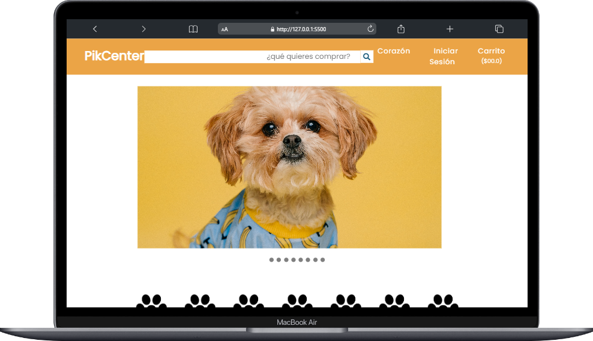

# PikCenter

La página web en cuestión es un portal de articulos para mascotas en línea que ofrece a los usuarios acceso a una variedad de productos de la actualidad.

## Tabla de Contenidos

- [PikCenter](#pikcenter)
  - [Tabla de Contenidos](#tabla-de-contenidos)
  - [Descripción](#descripción)
  - [Capturas de Pantalla](#capturas-de-pantalla)
  - [Demo en Vivo](#demo-en-vivo)
  - [Tecnologías Utilizadas](#tecnologías-utilizadas)
  - [Instalación](#instalación)
  - [Configuración](#configuración)
  - [Uso](#uso)
  - [Características](#características)
  - [Contribución](#contribución)

## Descripción

La página web en cuestión se presenta como un dinámico portal de articulos de mascotas, donde los usuarios tienen la posibilidad de acceder a una amplia gama de productos y artículos de actualidad.

## Capturas de Pantalla

 <div align="center">
      
</div>

## Demo en Vivo

[DEMO EN VIVO](https://kevinrivera1.github.io/WEB-PIKCENTER/)

## Tecnologías Utilizadas

- HTML
- CSS

## Instalación

Para usar **AGRISOFT** en tu propio entorno, sigue estos pasos:

1. Clona este repositorio en tu máquina local:

   ```bash
   git clone https://github.com/KevinRivera1/WEB-PIKCENTER.git
    ```

2. Abre el proyecto en tu editor de código favorito.
3. Abre el archivo `index.html` en tu navegador.
4. ¡Disfruta! 🎉

## Configuración

No requiere configuracion alguna.

## Uso

1. Abre el archivo `index.html` en tu navegador.
2. Explora el sitio web.

## Características

**Contenido Enfocado en Mascotas:** Esta página web de noticias se especializa en ofrecer contenido relacionado exclusivamente con el mundo de las mascotas, Mascotas, Jardineria, Snacks, Cuidados, Medicamentos.

## Contribución

¡Te invitamos a contribuir a nuestro proyecto! Si deseas colaborar, por favor sigue estos pasos:

1. Fork este repositorio.
2. Crea una rama (branch) con un nombre descriptivo.
3. Realiza tus cambios y mejoras en la nueva rama.
4. Abre una solicitud de extracción (pull request) para que revisemos tus contribuciones.
